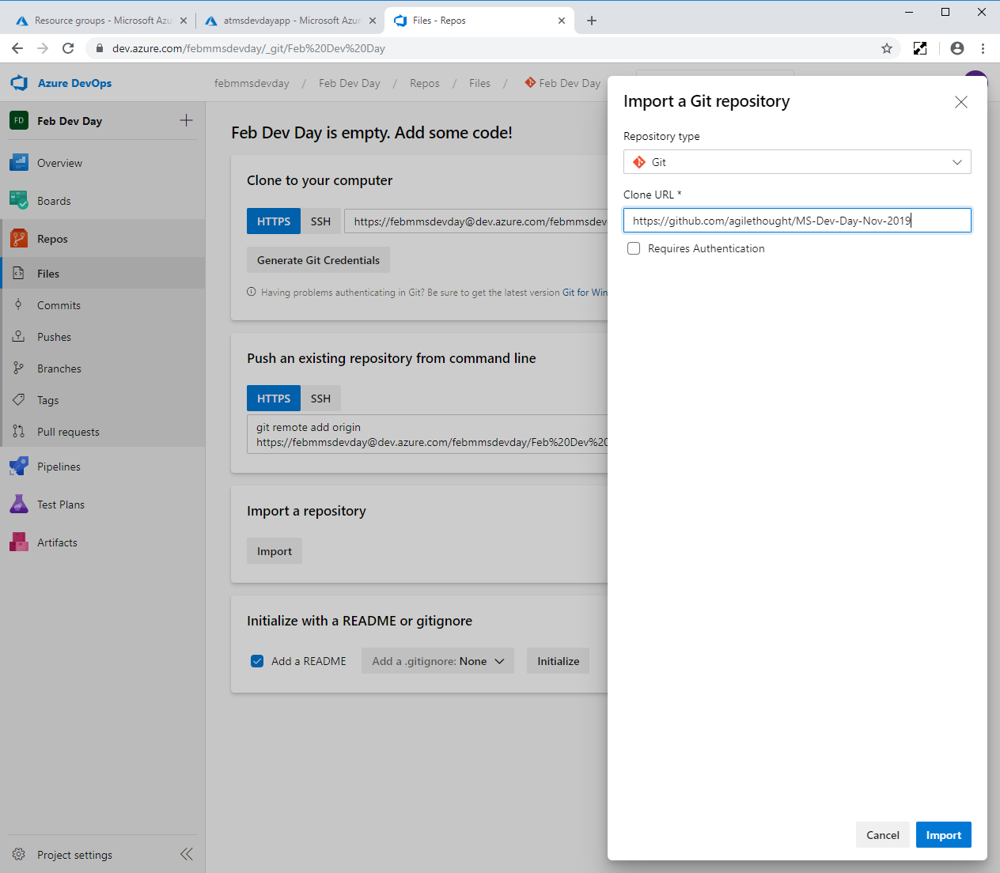

# AgileThought MS Dev Day Workshop

## Context

Today, we'll be discussing and developing an Azure DevOps pipeline wrapped around an Azure MLOps pipeline to proactively scale a Kubernetes cluster based on Machine Learning predictions.

At the end of the workshop, your Azure account will contain a working instance of this configuration for reference and experimentation.

We have included three Azure DevOps "challenges" over the course the workshop.  We will update this documentation with solutions to these challenges as we go.

## Steps

### Azure Account Setup

> NOTE: This workshop is going to involve provisioning and configuring Azure resources such as ML Pipelines, Kubernetes Clusters, Azure Active Directory App Registrations, and Azure DevOps projects.  If you already have a corporate Azure account, there's a good chance that you do not have permission to take these actions.  If that's the case, we recommend that you sign up for a fresh Azure Free Account.

1. Create a new Azure Free Account *(if necessary)*
    - Navigate to https://azure.microsoft.com/en-us/free/
    - Select the "Start free" button

### Pick a Unique Identifier

We are going to need to create Azure resources that need globally unique identifiers.  To do this, we're going to use a "base name prefix" throughout the workshop. **This prefix should be 7-8 characters and only contain numbers and lowercase letters.**  Pick an identifier of the following format and write it down:

```
<your-initials><4 random digits>
```

For instance, I might pick `mms4721`.  You will use this wherever you see the `<baseName>` token in scripts and variables.

### Kubernetes Cluster Provisioning

Provisioning the Kubernetes cluster can take a few minutes.  Let's crack open Azure Cloud Shell and get that started in the background.

1. Navigate to the Azure Cloud Shell at https://shell.azure.com
1. Use the following script to create an Azure Resource Group, Service Principal, and AKS Cluster ([docs](https://docs.microsoft.com/en-us/azure/aks/kubernetes-walkthrough))
    ```
    # az login # Not required in Azure Cloud Shell

    # If you've already run this script, you'll need to remove cached service principal info in Azure
    # rm .azure/aksServicePrincipal.json

    az group create --name <baseName>-AML-RG --location eastus

    az provider register --namespace Microsoft.Network
    az provider register --namespace Microsoft.Compute
    az provider register --namespace Microsoft.Storage

    az ad sp create-for-rbac --name atmsdevdayapp

    # `aks create` will take a while!
    # substitute values from `create-for-rbac` above!
    az aks create --resource-group <baseName>-AML-RG \
        --name atDevDayCluster \
        --service-principal <appId from create-for-rbac> \
        --client-secret <password from create-for-rbac> \
        --node-count 1 \
        --vm-set-type VirtualMachineScaleSets \
        --enable-cluster-autoscaler \
        --generate-ssh-keys \
        --node-vm-size Standard_D2_v3 \
        --min-count 1 \
        --max-count 2

    # disable auto-scaling so we can proactively scale!
    az aks update --resource-group <baseName>-AML-RG --name atDevDayCluster --disable-cluster-autoscaler
    ```  
    
    - If you get Service Principal errors, review the following article: [Service principals with Azure Kubernetes Service (AKS)](https://docs.microsoft.com/en-us/azure/aks/kubernetes-service-principal)
    - This script will take a few minutes to provision the cluster
1. Verify that AKS Cluster has been created correctly
    1. `Azure Portal -> Kubernetes services -> atDevDayCluster -> Settings -> Node pools`
        - `nodepool1` should be present and `Node count` should be `1`  
        

Congratulations! You have created an AKS Cluster.  We will use the ML models to proactively scale the cluster later in the workshop.

### Azure and Azure DevOps Setup

1. Record Azure Service Principal Information and Create a Client Secret
    - `Portal -> Azure Active Directory -> App registrations -> atmsdevdayapp`
    - Record the following:
        - Application (client) ID
        - Directory (tenant) ID
    - Create a Client Secret
        - `Portal -> AAD -> App Registrations -> <This Registration> -> Certificates & secrets -> New client secret`
            - Description: `AT Dev Day Client Secret`
            - Expires: `Never`
        - Record Client Secret value  
        
1. Create a new Azure DevOps Organization *(if necessary)* ([docs](https://docs.microsoft.com/en-us/azure/devops/organizations/accounts/create-organization?view=azure-devops))
    - Navigate to https://azure.microsoft.com/en-us/pricing/details/devops/azure-devops-services/
    - Select the Basic Plan column's "Start free >" button
1. Create a new Azure DevOps Project ([docs](https://docs.microsoft.com/en-us/azure/devops/organizations/projects/create-project?view=azure-devops&tabs=browser))
    - `Azure DevOps Organization Screen -> + New project (top right)`
1. Clone the source repo into your project
    - `Sidebar -> Repos -> Import -> https://github.com/agilethought/MS-Dev-Day-2020-02`  
    
1. Capture Configuration Data in an Azure DevOps Variable Group
    - `Azure DevOps Project -> Sidebar -> Pipelines -> Library -> Variable Groups -> "+ Variable group`
        - Variable group name: `devopsforai-aml-vg`
        - Add the following variables:

            | Variable Name | Suggested Value |
            | ------------- | --------------- |
            | AML_COMPUTE_CLUSTER_NAME | `train-cluster` |
            | BASE_NAME | `<baseName>` |
            | EXPERIMENT_NAME | `mlopspython` |
            | LOCATION | `eastus` |
            | MODEL_NAME | `sklearn_regression_model.pkl` |
            | SOURCES_DIR_TRAIN | `python_scripts` |
            | SP_APP_ID | `<Application (client) ID from above>` |
            | SP_APP_SECRET | `<Client Secret Value from above>` |
            | SUBSCRIPTION_ID | `<Azure Subscription ID>` |
            | TENANT_ID | `<Directory (tenant) ID from above>` |
            | TRAIN_SCRIPT_PATH | `train.py` |
            | TRAINING_PIPELINE_NAME | `training-pipeline` |
1. Create an Azure Resource Manager Service Connection ([docs](https://docs.microsoft.com/en-us/azure/devops/pipelines/library/service-endpoints?view=azure-devops&tabs=yaml#create-a-service-connection))
    - `Azure DevOps Project Sidebar -> Project settings -> Pipelines -> Service connections -> + New service connection -> Azure Resource Manager -> Service principal (automatic)`
        - Subscription: `<Your Azure Subscription>`
        - Scope Level: `Subscription`
        - Resource Group: Leave Blank  
        - Service connection name: `AzureResourceConnection`
    
1. Create a Build to Provision Azure Resources
    1. `Azure DevOps Project Sidebar -> Pipelines -> Create Pipeline`
        - Where is your code?: `Azure Repos Git`
        - Select your imported repo
        - Configure your pipeline: `Existing Azure Pipelines YAML file`
            - Branch: `master`
            - Path: `/build_pipeline_scripts/iac-create-environment.yml`
        - Suggested Name: `Provision Azure Environment`
    1. Run the Build
        - `Newly Created Build Pipeline -> Run` (This will take a few minutes!)
    1. Verify Azure Resource Creation
        - `Azure Portal -> Resource groups -> <baseName>-AML-RG`
        - Verify that 5 resources have been created:  
        

Congratulations!  You have configured the large majority of the Azure resources necessary for this workshop.

## Create the ML Pipeline

1. Create a Blob Container and Load Log Data
    1. `Azure Portal -> Storage Accounts -> <baseName>amlsa -> Blob Service -> Containers > + Container`
        - Name: `modeldata`
        - Public access level: `Private (no anonymous access)`
    1. Select the newly created `modeldata` container
        - Download [`log_data.pkl`](https://github.com/agilethought/MS-Dev-Day-2020-02/raw/master/data/log_data.pkl)
        - Upload (top left)
            - File: `log_data.pkl` that you just downloaded
1. Capture Blob Storage Variable Group Entries
    - `Azure DevOps Project -> Sidebar -> Pipelines -> Library -> Variable Groups -> devopsforai-aml-vg`
        - Add the following variables:

            | Variable Name | Suggested Value |
            | ------------- | --------------- |
            | STORAGE_ACCT_NAME | `<baseName>amlsa` |
            | STORAGE_ACCT_KEY | `<Azure Portal -> Storage Accounts -> <Your Storage Account> -> Settings -> Access Keys>` |
            | STORAGE_BLOB_NAME | `modeldata` |
1. Create an Azure DevOps Pipeline to Create the ML Pipeline
    1. `Azure DevOps Project Sidebar -> Pipelines -> Pipelines -> New pipeline`
        - Where is your code?: `Azure Repos Git`
        - Select your imported repo
        - Configure your pipeline: `Existing Azure Pipelines YAML file`
            - Branch: `master`
            - Path: `/build_pipeline_scripts/model-build.yml`
        - Suggested Name: `Build ML Pipeline`
    1. Run the Pipeline
        - `Newly Created Build Pipeline -> Run` (This will take a few minutes!)
        - Verify that ML Pipeline was created
            - `Azure Portal -> Machine Learning -> <Your ML Workspace> -> Pipelines`
            - You should see a pipeline named `training-pipeline`  
            

Congratulations!  You have created an Azure ML Pipeline.  We will train the pipeline in the next section.

## Challenge Two - Train the ML Pipeline

Now that we have created the MLOps Pipelines, we need to train them.  Your challenge is to create an Azure DevOps release to execute the `run_train_pipeline.py` script to perform this task.

- When configuring the build artifacts used in the release, set the `Source Alias` to `_model-build`.
- Execute the following script in the release:
    ```
    docker run -v $(System.DefaultWorkingDirectory)/_model-build/mlops-pipelines/python_scripts/:/script \
    -w=/script -e MODEL_NAME=$MODEL_NAME -e EXPERIMENT_NAME=$EXPERIMENT_NAME \
    -e TENANT_ID=$TENANT_ID -e SP_APP_ID=$SP_APP_ID -e SP_APP_SECRET=$SP_APP_SECRET \
    -e SUBSCRIPTION_ID=$SUBSCRIPTION_ID -e RELEASE_RELEASEID=$RELEASE_RELEASEID \
    -e BUILD_BUILDID=$BUILD_BUILDID -e BASE_NAME=$BASE_NAME \
    -e STORAGE_ACCT_NAME=$STORAGE_ACCT_NAME -e STORAGE_ACCT_KEY=$STORAGE_ACCT_KEY -e STORAGE_BLOB_NAME=$STORAGE_BLOB_NAME \
    mcr.microsoft.com/mlops/python:latest python run_train_pipeline.py
    ```  

Raise your hand when complete. The first completion will receive a raffle entry!
